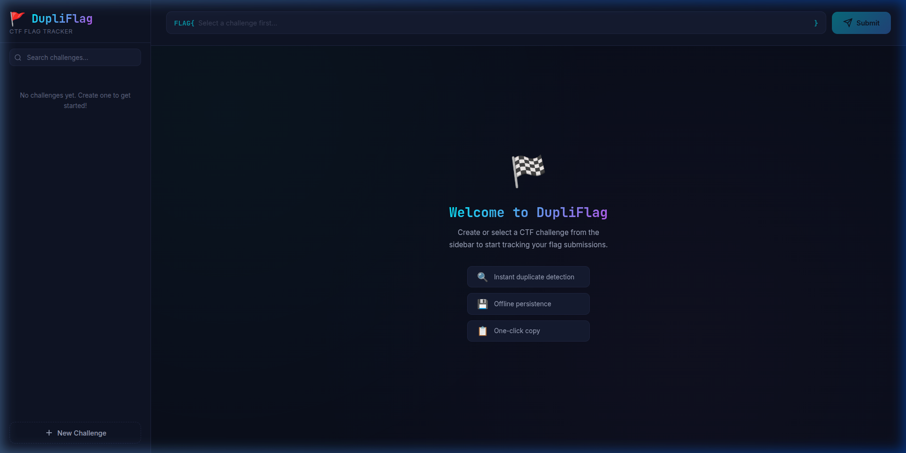
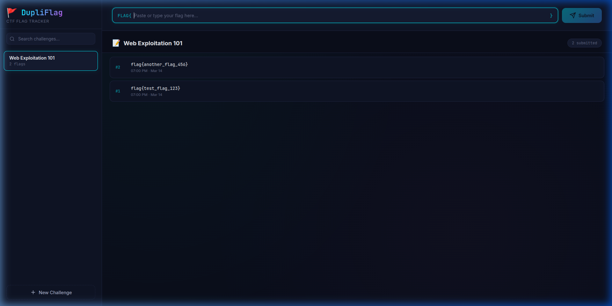

# 🚩 DupliFlag — CTF Flag Duplicate Checker

> **Never submit a duplicate CTF flag again.** Track your flag submissions per challenge and instantly detect duplicates.



---

## ✨ Features

| Feature | Description |
|---------|-------------|
| 🔍 **Instant Duplicate Detection** | Immediately warns you when a flag has already been submitted |
| 📁 **Challenge Sessions** | Organize flags by CTF challenge/problem — each under its own session |
| 💾 **Offline Persistence** | All data saved to `localStorage` — works without internet, no backend needed |
| 📋 **One-Click Copy** | Copy any flag to clipboard with a single click |
| 🗑️ **Easy Management** | Delete individual flags or entire challenge sessions |
| 🔎 **Search Challenges** | Quickly find a challenge from your list with the search bar |
| 📱 **Fully Responsive** | Works beautifully on desktop, tablet, and mobile |
| 🎨 **Cyber Dark Theme** | Premium dark UI with neon accents — built for the CTF aesthetic |

---

## 📸 Screenshots

### Welcome Screen
The landing page greets you with a clean interface and feature highlights.


### Flag Tracking in Action
Submit flags, see timestamps, and get instant duplicate warnings.



---

## 🚀 How It Works

1. **Create a Challenge** → Click "New Challenge" in the sidebar and name it (e.g., "Web Exploitation 101")
2. **Submit Flags** → Paste or type your candidate flag into the input field and hit Submit
3. **Duplicate Check** → If the flag was already submitted for this challenge, you'll see a ⚠️ warning toast
4. **New Flag Accepted** → Unique flags are added to the history with a timestamp
5. **Review History** → Scroll through all submitted flags, copy them, or delete as needed
6. **Persist Across Sessions** → Close the tab and come back — all your data is still there

---

## 🛠 Tech Stack

| Technology | Purpose |
|------------|---------|
| [Vite 8](https://vite.dev) | Lightning-fast build tool |
| [React 19](https://react.dev) | Component-based UI framework |
| Vanilla CSS | Custom dark theme with CSS custom properties |
| localStorage | Zero-backend data persistence |
| [GitHub Pages](https://pages.github.com) | Free static site hosting |

---

## 💻 Getting Started

### Prerequisites
- [Node.js](https://nodejs.org) v18+ installed

### Run Locally

```bash
# Clone the repo
git clone https://github.com/uchihashahin01/dupli-flag-checker.git
cd dupli-flag-checker

# Install dependencies
npm install

# Start the dev server
npm run dev
```

Open [http://localhost:5173/dupli-flag-checker/](http://localhost:5173/dupli-flag-checker/) in your browser.

### Build for Production

```bash
npm run build
npm run preview
```

---

## 🌐 Deployment

This project is configured for automatic deployment to **GitHub Pages** via GitHub Actions.

Every push to the `main` branch triggers a build and deploy workflow.

**Live URL:** `https://uchihashahin01.github.io/dupli-flag-checker/`

---

## 📂 Project Structure

```
dupli-flag-checker/
├── public/
│   └── favicon.svg
├── src/
│   ├── components/
│   │   ├── FlagHistory.jsx / .css
│   │   ├── FlagInput.jsx / .css
│   │   ├── SessionList.jsx / .css
│   │   └── Toast.jsx / .css
│   ├── hooks/
│   │   └── useLocalStorage.js
│   ├── App.jsx / .css
│   ├── index.css
│   └── main.jsx
├── .github/workflows/
│   └── deploy.yml
├── index.html
├── vite.config.js
└── package.json
```

---

## 🤝 Contributing

Contributions are welcome! Please feel free to submit a Pull Request.

1. Fork the project
2. Create your feature branch (`git checkout -b feature/amazing-feature`)
3. Commit your changes (`git commit -m 'Add some amazing feature'`)
4. Push to the branch (`git push origin feature/amazing-feature`)
5. Open a Pull Request

---

## 📜 License

This project is open source and available under the [MIT License](LICENSE).

---

<p align="center">
  Built with ❤️ for the CTF community
</p>
